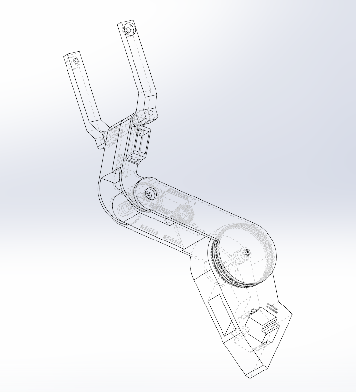

# Вертикальный стабилизатор
Проект для Физтех.Фабрики: Вертикальный стабилизатор

## Состав проектной команды
- Георгий Токарев Б01-305
- Кулагин Сергей  Б01-304
- Хасэгава Кай    Б01-301

## Цель проекта
Спроектировать и изготовить вертикальный 
стабилизатор для работы с фотоаппаратом или видеокамерой при ручной съёмке

## Задачи
- Выбрать необходимые материалы, приводы и другие компоненты
- Разработать ПО
- Спроектировать все элементы прототипа
- Изготовить детали
- Собрать прототип, провести испытания

## Оборудование
### Компоненты
- Шаговый двигатель NEMA2357HS
- Драйвер шагового двигателя TB6600
- Привод MG995
- Ремни Chesbelt HTD 5M/3M
- Акселерометр - гироскоп BMI160
- Arduino pro micro 5V
- Преобразователь напряжения LM25966 5V
- Подшипники RS608

## Ход работы

При начальном планировании было решено использовать в качестве основного материала сталь в силу её прочности, однако при дальнейшей работе основные материалы были изменены на PLA/PETG пластик, т.к. пришлось использовать шаговый двигатель вместо приводов, что означает использование редукторов. Это кратно увеличивает сложность разработки и изготовления деталей из металла.
PETG пластик использовался для шкивов, а корпус изготовлен из PLA пластика

## Разное
[Постер](ВертикальныйстабилизаторПостер.pdf)  
[Презентация](Вертикальныйстабилизатор1.pptx)  
[Telegram канал](https://t.me/Gimbal57)

